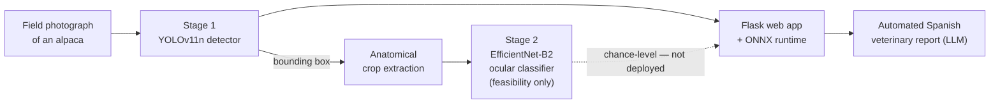
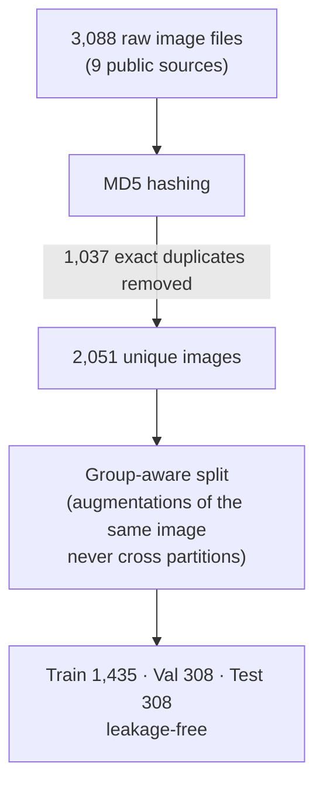
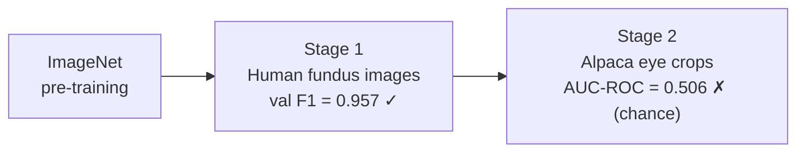

# Automatic Detection of Morphological Anomalies in Altiplano Alpacas Using Computer Vision

[](https://doi.org/10.5281/zenodo.21134001)
[](LICENSE)
[](#data)
[](https://www.python.org/)
[](https://pytorch.org/)
[](https://docs.ultralytics.com)
[-1a7f8e.svg)](https://www.mdpi.com/journal/animals)
[](#citation)

A reproducible computer-vision system for alpacas (*Vicugna pacos*) of the **Peruvian
Altiplano**: a **curated, deduplicated, leakage-free detection dataset**, a **compact
YOLOv11 body detector**, a **data-integrity methodology** for auto-labelling pipelines, and
an **honest feasibility study** of automatic ocular anomaly classification.

> **Companion code for the manuscript:**
> *Automatic Detection of Morphological Anomalies in Altiplano Alpacas Using a Computer
> Vision System: A Curated Dataset, Compact Detector, and Ocular Anomaly Classification
> Feasibility Study.*
> In preparation for *Animals* (MDPI), Q1 Veterinary Sciences.

---

## Table of contents
- [Overview](#overview)
- [Key results](#key-results)
- [How it works](#how-it-works)
- [Repository structure](#repository-structure)
- [Data](#data)
- [Installation](#installation)
- [Reproducing the study](#reproducing-the-study)
- [Honest scope and limitations](#honest-scope-and-limitations)
- [Citation](#citation)
- [License & contact](#license--contact)

---

## Overview

Peru concentrates ~87% of the world's alpacas, yet no public computer-vision dataset or
automated diagnostic system exists for the species, and morphological-anomaly detection
still relies on subjective visual inspection by veterinarians who are scarce in remote
high-altitude communities. This repository contributes, to our knowledge, the **first open,
curated detection benchmark for alpacas** and an honest assessment of what current
auto-labelling can and cannot deliver.

- **2,051 unique labelled images** consolidated from nine public Roboflow Universe sources,
  after removing **1,037 exact (MD5) duplicates** — 186 of which had leaked across the
  original train/test boundary and inflated earlier metrics.
- A compact **YOLOv11n** body detector (2.58M parameters, 5.3 MB, ONNX-exportable) reaches
  **mAP@0.5 = 0.860** on a strictly **leakage-free** held-out test set.
- A **data-integrity methodology** (MD5 deduplication, group-aware splitting, label-conflict
  resolution) that detected and corrected the leakage — released so others can audit it.
- An **honest negative result**: under a leakage-free protocol, vision-language
  auto-labelling of ocular anomalies yields a classifier that performs **at chance**
  (AUC-ROC = 0.506), which we trace to unreliable labels **and** a physical resolution
  ceiling of the crops — showing expert veterinary ground truth and purpose-acquired
  close-up imagery are required.
- A deployed **Flask web application** with real-time inference and automated
  Spanish-language veterinary reporting.

---

## Key results

Detector metrics are on the **leakage-free** held-out test set (*n* = 308 images, 498
instances), reproduced from the released checkpoints.

| Model | mAP@0.5 | mAP@0.5:0.95 | Precision | Recall | Params | Size |
|---|:---:|:---:|:---:|:---:|:---:|:---:|
| **YOLOv11n** (deployed) | **0.860** | 0.693 | 0.913 | 0.731 | 2.58M | 5.3 MB |
| YOLOv11s (ablation) | 0.863 | 0.711 | 0.903 | 0.766 | 9.43M | 18.3 MB |

Ocular anomaly classifier — **feasibility study / honest negative result** (leakage-free
test, *n* = 70: 14 anomaly / 56 normal):

| Metric | Value | 95% CI |
|---|:---:|:---:|
| AUC-ROC | **0.506** | [0.366, 0.645] |
| Average Precision | 0.195 | — |
| F1 (anomaly) | 0.065 | — |
| Accuracy | 0.586 | — |

> The classifier is **statistically indistinguishable from chance**. The same pipeline
> reaches F1 = 0.957 on real, expertly labelled human-fundus data, so the failure is in the
> auto-generated labels — not the model. A post-hoc measurement further showed the eye crops
> are physically too small (median smaller side ≈ 31 px; source images ≈ 375 px, none
> > 1000 px) for fine ocular assessment.

---

## How it works

### System pipeline



The deployed system localises the animal with the detector; the ocular classifier is
reported as a **feasibility study and is not used for diagnosis** (see
[Honest scope](#honest-scope-and-limitations)).

### Stage 1 — YOLOv11n body detector (convolutional object detection)

YOLOv11n is a **single-stage, anchor-free convolutional object detector**. Each image is
passed once through three convolutional components:

1. **Backbone** — stacked convolutional blocks (CSP-style C3k2 modules) that progressively
   downsample the image into hierarchical **feature maps**, learning edges → textures →
   alpaca-shaped patterns.
2. **Neck** — a feature-pyramid / path-aggregation network that fuses features across scales
   so both near and distant alpacas are detected.
3. **Head** — predicts, per grid location, the **bounding-box** coordinates and an
   objectness/confidence score for the single class `alpaca`.

The model is deliberately compact (**2.58 M parameters, 6.3 GFLOPs, 5.3 MB**), trained for
80 epochs (AdamW, lr₀ = 0.001, batch 8, 640×640, early stopping on val mAP@0.5) and exported
to **ONNX** for real-time field inference.

### Data-integrity methodology (why the metrics are trustworthy)



An audit revealed that exact-duplicate images and augmentation leakage had inflated the
first metrics we obtained. We deduplicate by MD5 hash, split at the level of **unique source
images**, and resolve label conflicts — so every number reported is leakage-free.

### Stage 2 — EfficientNet-B2 ocular classifier (two-stage transfer learning)

EfficientNet-B2 is a convolutional classifier built from **MBConv blocks with
squeeze-and-excitation**, sized by **compound scaling** (depth, width and input resolution
grown together, ~9 M parameters) for a strong accuracy-to-size trade-off.



The identical pipeline reaches F1 = 0.957 on real, expertly labelled human-fundus data but
collapses to chance on the alpaca stage. The failure is therefore attributed to the
**auto-generated labels and the low crop resolution** (median smaller side ≈ 31 px), not to
the model — this is the paper's honest negative result.

## Repository structure

```
config/        dataset_stage1_clean.yaml, train_stage1_clean[_s].yaml  (leakage-free)
scripts/       eval_detector.py, evaluate_classifiers.py, train_two_stage.py,
               clean_detector_dataset.py, regen_classifier_figs.py, figure generators
src/           data/ models/ training/ evaluation/ webapp/ (Flask app)
paper/         manuscript/ (LaTeX + mdpi.cls), figures/, supplementary/, cover_letter/
docs/          DATASET_CARD.md, CLASIFICACION_OCULAR_VET.md (vet labelling protocol),
               PRECRIBADO_IA_batch01.md, ESTADO_PAPER.md
outputs/       figures/ (metrics JSON + paper figures)
models/        detector/best_clean*.pt (git-ignored; see Releases/Zenodo)
data/          (git-ignored; deposited to Zenodo) annotated_clean/ = curated dataset
```

---

## Data

The curated dataset (**2,051 unique images**, YOLO format, train/val/test = 1,435 / 308 /
308) is released under **CC BY 4.0** and deposited on Zenodo.

- **Zenodo DOI:** [10.5281/zenodo.21134001](https://doi.org/10.5281/zenodo.21134001) (see `docs/DATASET_CARD.md` for full provenance,
  preprocessing, and licensing).
- Sources: nine Roboflow Universe projects (single class `alpaca`); supplementary
  unlabelled imagery from iNaturalist (taxon 319688, Peru).

---

## Installation

Development and training run on **Linux** with an NVIDIA GPU.

```bash
python -m venv .venv-linux && source .venv-linux/bin/activate
pip install torch torchvision --index-url https://download.pytorch.org/whl/cu124
pip install -r requirements.txt
```

Secrets (API keys, DB URL) go in `.env` (git-ignored); see `.env.example`.

---

## Reproducing the study

```bash
source .venv-linux/bin/activate

# Detector — leakage-free test evaluation (~10 s)
python scripts/eval_detector.py --weights models/detector/best_clean.pt \
    --data config/dataset_stage1_clean.yaml --split test --device 0
# -> mAP@0.5 ~ 0.860 (YOLOv11n) ; best_clean_s.pt -> ~ 0.863 (YOLOv11s)

# Classifier — honest, group-aware evaluation
python scripts/evaluate_classifiers.py --task eyes         # -> AUC-ROC ~ 0.506 (chance)

# Regenerate the classifier figures from raw predictions
python scripts/regen_classifier_figs.py

# Compile the manuscript
cd paper/manuscript && pdflatex manuscript.tex && bibtex manuscript && \
    pdflatex manuscript.tex && pdflatex manuscript.tex
```

Model weights are distributed via GitHub Releases / Zenodo (not committed).

---

## Honest scope and limitations

This project deliberately reports what does **not** work as well as what does:

- **The detector works** and is deployable; the **ocular classifier does not** — it is at
  chance under a leakage-free protocol and is reported as a feasibility study, not a product.
- The failure is caused by (i) **LLM-vision auto-labels** without veterinary validation and
  (ii) a **physical resolution ceiling** (source images ≈ 375 px; eye crops ≈ 31 px).
- A working ocular classifier will require **expert veterinary ground truth** on
  **purpose-acquired, close-up** ocular imagery (eye region ≳ 128 px) — see
  `docs/CLASIFICACION_OCULAR_VET.md` for the clinical labelling protocol.
- All initially reported metrics (mAP 0.913, AUC 0.824) were **inflated by data leakage**
  and are superseded by the leakage-free numbers above.

---

## Citation

If you use this dataset or code, please cite (details to be updated on acceptance):

```bibtex
@article{vilcasolorzano2026alpacavision,
  title   = {Automatic Detection of Morphological Anomalies in Altiplano Alpacas Using a
             Computer Vision System: A Curated Dataset, Compact Detector, and Ocular
             Anomaly Classification Feasibility Study},
  author  = {Vilca-Solorzano, Richar Andre and Yana-Yucra, Dina Maribel and
             Ccopa-Acero, Cristian Daniel and Alem\'an-Gonzales, Leonid},
  journal = {Animals (MDPI)},
  year    = {2026},
  note    = {In preparation}
}
```

---

## License & contact

- **Code:** MIT License (see `LICENSE`).
- **Dataset:** Creative Commons Attribution 4.0 (CC BY 4.0).

Developed by the **Semillero de Investigación "John J. Hopfield — IIICCD"**, Escuela
Profesional de Ingeniería Estadística e Informática, **Universidad Nacional del Altiplano
de Puno (UNAP)**, Peru.

**Authors:** Richar Andre Vilca-Solorzano, Dina Maribel Yana-Yucra, Cristian Daniel
Ccopa-Acero · **Advisor:** Leonid Alemán-Gonzales (laleman@unap.edu.pe).
